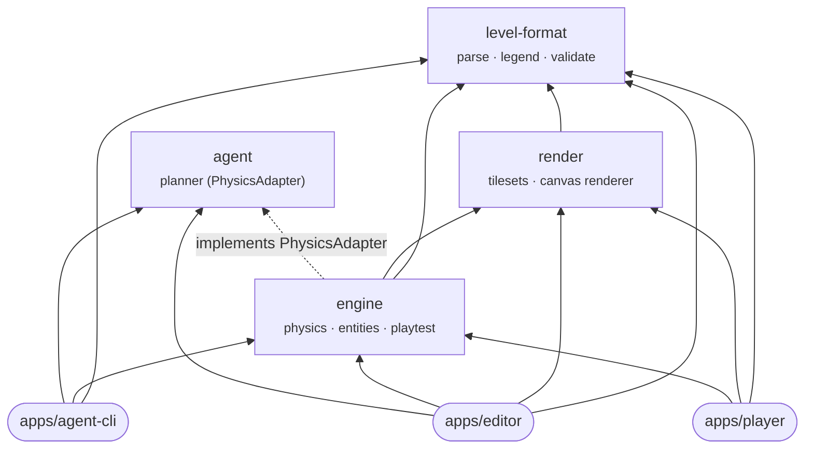

# Architecture

The project is a **monorepo of small, separately testable parts**: four
library *packages* that contain all the logic, three *apps* that wire those
packages into something you can run, and a *content* folder of game data.



Arrows point from a part to what it depends on. Lower parts never know
about higher ones: the level format knows nothing about drawing, the
renderer knows nothing about physics, and no package knows the apps exist.

## Layout

```
packages/                  libraries — all the logic, no page wiring
  level-format/            the ASCII level format: parse, serialize, legends, validate
  render/                  load a tileset, draw a level on a canvas
  engine/                  the game: physics, entities, input, playtest scene, launcher
  agent/                   the planning agent: finds input recordings that solve a level
  agent-py/                Python port of the engine physics + planner, and an MCP server

apps/                      runnable programs — thin wiring over the packages
  editor/                  the level editor (browser)            → /apps/editor/
  player/                  play levels full-window (browser)     → /apps/player/
  agent-cli/               solve levels from the terminal        → deno task solve

content/data/              game data: levels/*.txt, tilesets/, audio/ (+ generated manifests)
scripts/                   repo tooling: manifest generators, the layering check
index.html                 landing page linking the two browser apps
```

## The packages

| Package | Responsibility | Depends on |
|---|---|---|
| [`level-format`](packages/level-format/) | What a level *is*: the text format, header directives, the glyph legend and each glyph's role (player, exit, hazard, …), validation, and the pickup rule. Pure logic — no DOM, no I/O. | — |
| [`render`](packages/render/) | What a level *looks like*: loading a tileset (`tile_lookup.json` + images), autotiling, animated sprites, and drawing a level (with an optional camera window) onto a canvas. Used by the editor preview *and* the game, so both paint identical frames. | level-format |
| [`engine`](packages/engine/) | How a level *plays*: the game loop, keyboard/scripted input, AABB physics, entities, the playtest scene and camera, and `Playtest.launch()` to mount a level on a canvas. Its `JsPhysicsAdapter` (`jsAdapter`) exposes the engine to the agent. | level-format, render, agent (types only) |
| [`agent`](packages/agent/) | Whether a level *can be solved*: an A* planner over simulated physics that returns up to five distinct solutions with explanations. It never imports the engine — it drives any engine through the `PhysicsAdapter` interface it defines. | — |

## The apps

| App | What it does | Uses |
|---|---|---|
| [`editor`](apps/editor/) | Edit levels as text with a live tile preview, legend, undo, drafts in `localStorage`, playtest in place, and run the agent from the Test button. | all four packages |
| [`player`](apps/player/) | Choose a bundled level and play it full-window; `?level=<id>` links straight to a level. | level-format, render, engine |
| [`agent-cli`](apps/agent-cli/) | `deno task solve <level>` runs the agent headless and prints a report (or JSON); `--all` sweeps every bundled level. | level-format, engine, agent |

## Contracts between the parts

The parts only meet at a few well-defined contracts, which is what keeps
them independent:

| Contract | Defined in | Between |
|---|---|---|
| **Level text format** (`# name:`, `# tileset:`, grid glyphs, …) | `level-format` (`Level.parse` / `Level.serialize`, `LevelText`) | content, every app, `agent-py` |
| **Tileset format** (`tile_lookup.json`) | `render` (`Tileset.load`) + `level-format` (`Legend.fromLookup`) | content, editor, player, CLI |
| **`PhysicsAdapter`** (make a scene, make scripted input, step frames) | `agent` (`PhysicsAdapter`) | agent ↔ engine (`JsPhysicsAdapter`) |
| **Recording** (`{ frame, key, down }[]`) | `engine` (`ScriptedInput`) / `agent` (`RecordingEvent`) | agent → engine replay, CLI `--json` |
| **Golden vectors** (`packages/agent-py/tests/golden/vectors.json`) | `deno task gen:golden` | JS engine ↔ Python port: frame-for-frame physics parity |

## Enforcing the layering

Deno workspaces let any member import any other by name, so the rules in the
diagram are checked by [`scripts/check-boundaries.ts`](scripts/check-boundaries.ts),
which runs as part of `deno task check` (and so in CI). It fails if:

- a package imports a package it isn't allowed to depend on (e.g. `render` importing `engine`);
- a relative import (`../..`) reaches into another package instead of importing it by name;
- anything imports an app.

Tests get one exception: the agent's tests drive the real engine through
`jsAdapter`, so `packages/agent` tests may import `engine` and `level-format`.

## One site, shared content

The two browser apps are served by one Vite site (`vite.config.ts`), so
they share a single copy of `content/` (served at `/data/…`):

| URL | Page |
|---|---|
| `/` | landing page |
| `/apps/editor/` | editor |
| `/apps/player/` | player |
| `/data/levels/…`, `/data/tilesets/…` | game content |

Apps build data URLs from `import.meta.env.BASE_URL`, so the same code works
at `/` in development and under `/2D-platform-editor/` on GitHub Pages.

## Object-oriented design

Every package and app is written as object-oriented TypeScript, following the
conventions in [docs/README.md](docs/README.md). Each package has a class
diagram and one page per class, interface and enum under [`docs/`](docs/).
Where to see each idea in the code:

| Idea | Where it is demonstrated |
|---|---|
| **Encapsulation, static factories, private constructors** | [Level](docs/level-format/Level.md)`.parse`, [Tileset](docs/render/Tileset.md)`.load`, [World](docs/engine/World.md)`.fromLevel` |
| **Inheritance and polymorphism** | [Entity](docs/engine/Entity.md) → `Player`, `Platform`, `Coin`, `Spike`, `Goal`; [Action](docs/agent/Action.md) → `WalkAction`, `JumpAction`, … |
| **Interfaces with several implementations** | [InputSource](docs/engine/InputSource.md) (`KeyboardInput`, `ScriptedInput`), [Sprite](docs/render/Sprite.md) (`DrawSpec`, `SpriteAnimation`), [ReportFormatter](docs/agent-cli/ReportFormatter.md) (`TextFormatter`, `JsonFormatter`) |
| **Strategy** | [Planner](docs/agent/Planner.md) with `PerFramePlanner` and `BucketPlanner`, chosen by [PlannerFactory](docs/agent/PlannerFactory.md) |
| **Template method** | [ModalDialog](docs/editor/ModalDialog.md) (five dialogs), [Splitter](docs/editor/Splitter.md), `Planner.replan()` |
| **Adapter** | [JsPhysicsAdapter](docs/engine/JsPhysicsAdapter.md) adapts the engine to the agent's `PhysicsAdapter` interface |
| **Command** | [Command](docs/agent-cli/Command.md) — `SolveCommand`, `SolveAllCommand`, `HelpCommand` |
| **Dependency injection** (depend on interfaces, pass fakes in tests) | [KeyValueStore](docs/editor/KeyValueStore.md), [TilesetIO](docs/render/TilesetIO.md), [FileReader](docs/agent-cli/FileReader.md), [SceneHost](docs/engine/SceneHost.md) |
| **Composition root** | [EditorApp](docs/editor/EditorApp.md) builds and wires every editor component; `main.ts` is three lines |
| **Value objects and immutability** | [PickupRequirement](docs/level-format/PickupRequirement.md), [StateKey](docs/agent/StateKey.md), [LevelText](docs/level-format/LevelText.md) (edits return a new object) |
| **Enums** | [Role](docs/level-format/Role.md), [GamePhase](docs/engine/GamePhase.md), `ActionKind`, `EditorMode`, `Severity`, … — string values that match the data formats |

## Tests

| Kind | Where | Run with |
|---|---|---|
| Unit tests (`Deno.test`) | beside the code, `*.test.ts` in each package/app | `deno task test` |
| End-to-end (Playwright) | `apps/<app>/e2e/*.spec.ts` — only what needs a real browser (DOM, canvas pixels, keyboard) | `deno task test:e2e` |
| Layering | `scripts/check-boundaries.ts` | `deno task check` |
| Physics parity | `packages/agent-py/tests/` against the golden vectors | `cd packages/agent-py && python3 -m pytest` |
