# agent-cli

`apps/agent-cli` · app (`deno task solve`)

A headless command-line front end for the planning agent: `deno task solve
<level>` answers "can the agent finish this level?" without a browser, and
`--all` sweeps every bundled level. It uses
[level-format](../level-format/README.md), [engine](../engine/README.md) and
[agent](../agent/README.md), and needs only `--allow-read`. Usage, flags,
exit codes and the JSON shape are in the app's
[README](../../apps/agent-cli/README.md).

The entry point is [`main.ts`](../../apps/agent-cli/main.ts), a composition
root that builds the real console and file system and hands them to
[AgentCli](AgentCli.md). Every class lives in `apps/agent-cli/src/`.

## Class diagram

```mermaid
classDiagram
  direction TB

  class AgentCli {
    +run(argv) ExitCode
  }
  class ArgParser {
    +number DEFAULT_BUDGET_MS$
    +string DEFAULT_CONTENT_DIR$
    +string USAGE$
    +parse(argv) Command$
  }
  class Command {
    <<interface>>
    +execute(context) ExitCode
  }
  class CommandContext {
    <<interface>>
    +Output output
    +FileReader files
  }
  class HelpCommand {
    +string usage
    +execute(context) ExitCode
  }
  class AgentCommand {
    <<abstract>>
    +RunOptions options
    +execute(context) ExitCode*
    #formatter() ReportFormatter
    #store(context) ContentStore
    #solver() LevelSolver
  }
  class SolveCommand {
    +string level
    +execute(context) ExitCode
  }
  class SolveAllCommand {
    +execute(context) ExitCode
  }
  class RunOptions {
    <<interface>>
    +budgetMs, json, contentDir
  }
  class ContentStore {
    +string contentDir
    +readManifest() ManifestEntry[]
    +loadBundled(entry) LevelFile
    +resolve(ref) LevelFile
    +loadLegend(tilesetId) LoadedLegend
    +prepare(file) PreparedLevel
  }
  class FileReader {
    <<interface>>
    +readTextFile(path) string
  }
  class DenoFileReader
  class Output {
    <<interface>>
    +out(text)
    +err(text)
  }
  class ConsoleOutput
  class LevelSolver {
    +solve(level, budgetMs) LevelReport
    +describeFailure(result, parsed) string[]$
  }
  class ReportFormatter {
    <<interface>>
    +report(report) string
    +sweepHeader(idWidth) string?
    +sweepRow(report, idWidth) string?
    +sweepSummary(summary, reports) string
  }
  class TextFormatter {
    +number MAX_LISTED_ISSUES$
    +issueLine(issue) string$
    +summaryLine(summary) string
  }
  class JsonFormatter
  class SweepSummary {
    +of(reports) SweepSummary$
    +boolean allSolved
  }
  class SweepTotals {
    <<interface>>
    +total, solved, unsolved, invalid, elapsedMs, failed
  }
  class LevelFile {
    <<interface>>
    +id, path, text
  }
  class PreparedLevel {
    <<interface>>
    +parsed, legend, tilesetWarning
  }
  class ManifestEntry {
    <<interface>>
    +id, name, file, group
  }
  class LoadedLegend {
    <<interface>>
    +legend, warning
  }
  class SolvedReport {
    <<interface>>
  }
  class UnsolvedReport {
    <<interface>>
  }
  class InvalidReport {
    <<interface>>
  }
  class LevelInfo {
    <<interface>>
  }
  class SolutionReport {
    <<interface>>
  }
  class ReportStatus {
    <<enumeration>>
    Solved
    Unsolved
    Invalid
  }
  class ExitCode {
    <<enumeration>>
    Solved
    Failed
    Usage
  }
  class UsageError
  class InputError

  AgentCli ..> ArgParser : parse()
  AgentCli --> CommandContext
  AgentCli ..> ExitCode
  ArgParser ..> Command : creates
  ArgParser ..> UsageError : throws
  HelpCommand ..|> Command : implements
  AgentCommand ..|> Command : implements
  SolveCommand --|> AgentCommand : extends
  SolveAllCommand --|> AgentCommand : extends
  AgentCommand --> RunOptions
  Command ..> CommandContext
  CommandContext --> Output
  CommandContext --> FileReader
  ConsoleOutput ..|> Output : implements
  DenoFileReader ..|> FileReader : implements
  AgentCommand ..> ContentStore : store()
  AgentCommand ..> LevelSolver : solver()
  AgentCommand ..> ReportFormatter : formatter()
  TextFormatter ..|> ReportFormatter : implements
  JsonFormatter ..|> ReportFormatter : implements
  ContentStore --> FileReader
  ContentStore ..> InputError : throws
  ContentStore ..> ManifestEntry
  ContentStore ..> LevelFile
  ContentStore ..> LoadedLegend
  ContentStore ..> PreparedLevel
  PreparedLevel --|> LevelFile : extends
  LevelSolver ..> PreparedLevel : solves
  LevelSolver ..> SolvedReport
  LevelSolver ..> UnsolvedReport
  LevelSolver ..> InvalidReport
  SolvedReport *-- SolutionReport
  SolvedReport --> LevelInfo
  UnsolvedReport --> LevelInfo
  InvalidReport --> LevelInfo
  SolvedReport ..> ReportStatus
  UnsolvedReport ..> ReportStatus
  InvalidReport ..> ReportStatus
  SolveAllCommand ..> SweepSummary : of()
  SweepSummary ..|> SweepTotals : implements
```

`*--` composition, `-->` association (holds / refers to), `..>` dependency
(uses), `--|>` extends, `..|>` implements. A trailing `*` marks an abstract method and
`?` a result that may be null.

## Pages

| Kind | Page | In one line |
|---|---|---|
| class | [AgentCli](AgentCli.md) | Parse, execute, and turn expected errors into exit code 2 |
| class | [ArgParser](ArgParser.md) | argv in, a `Command` object out; owns the usage text |
| abstract class | [AgentCommand](AgentCommand.md) | Base of the commands that run the agent |
| class | [SolveCommand](SolveCommand.md) | `solve <level>`: one level, one report |
| class | [SolveAllCommand](SolveAllCommand.md) | `solve --all`: every bundled level, then a summary |
| class | [HelpCommand](HelpCommand.md) | `--help`: print the usage text |
| class | [ContentStore](ContentStore.md) | A content folder: find levels, load tileset legends |
| class | [DenoFileReader](DenoFileReader.md) | The real `FileReader` (Deno's file system) |
| class | [ConsoleOutput](ConsoleOutput.md) | The real `Output` (stdout / stderr) |
| class | [LevelSolver](LevelSolver.md) | Validate, run the agent, build a report |
| class | [SweepSummary](SweepSummary.md) | Totals for an `--all` sweep |
| class | [TextFormatter](TextFormatter.md) | Reports as aligned text for people |
| class | [JsonFormatter](JsonFormatter.md) | Reports as JSON for tools |
| class | [UsageError](UsageError.md) | A bad command line |
| class | [InputError](InputError.md) | A missing or unreadable input file |
| interface | [Command](Command.md) | Anything the CLI can execute |
| interface | [CommandContext](CommandContext.md) | The output and files a command may use |
| interface | [Output](Output.md) | Where text goes: `out` and `err` |
| interface | [FileReader](FileReader.md) | Reads a text file |
| interface | [ReportFormatter](ReportFormatter.md) | Turns reports into printable text |
| interface | [RunOptions](RunOptions.md) | `--budget`, `--json`, `--content` |
| interface | [ManifestEntry](ManifestEntry.md) | One row of `levels/manifest.json` |
| interface | [LevelFile](LevelFile.md) | A level's text and where it came from |
| interface | [PreparedLevel](PreparedLevel.md) | A parsed level with its legend |
| interface | [LoadedLegend](LoadedLegend.md) | A legend plus a tileset warning |
| interface | [SweepTotals](SweepTotals.md) | The counts in a sweep's JSON `summary` |
| interface | [LevelInfo](LevelInfo.md) | Which level a report is about |
| interface | [SolvedReport](SolvedReport.md) | The report when the agent succeeds |
| interface | [UnsolvedReport](UnsolvedReport.md) | The report when it does not |
| interface | [InvalidReport](InvalidReport.md) | The report when validation fails |
| interface | [SolutionReport](SolutionReport.md) | One solution in a solved report |
| enum | [ReportStatus](ReportStatus.md) | `solved` / `unsolved` / `invalid` |
| enum | [ExitCode](ExitCode.md) | 0 / 1 / 2 |

One type alias completes the model: `LevelReport` (`InvalidReport |
SolvedReport | UnsolvedReport`, in `LevelReport.ts`), the union every report
consumer takes and narrows by `status`.

## Design overview

- **Command objects.** [ArgParser](ArgParser.md) does not return flags for
  someone else to interpret; it returns a ready-to-run
  [Command](Command.md). [AgentCli](AgentCli.md) then treats every command
  alike: `execute(context)` and exit with the result. Adding a command means
  a new class and one branch in the parser.
- **Interface and abstract class together.** `Command` is the contract;
  [AgentCommand](AgentCommand.md) is shared *implementation* for the two
  commands that run the agent (options, formatter, content store, solver).
  [HelpCommand](HelpCommand.md) needs none of that, so it implements the
  interface directly instead of inheriting.
- **Polymorphic output.** `--json` picks a [JsonFormatter](JsonFormatter.md)
  instead of a [TextFormatter](TextFormatter.md), once, in
  `AgentCommand.formatter()`. The commands call the same four
  [ReportFormatter](ReportFormatter.md) methods either way and never check
  which one they have.
- **Depend on interfaces.** Commands reach the outside world only through
  [CommandContext](CommandContext.md): an [Output](Output.md) and a
  [FileReader](FileReader.md). `main.ts` passes the real
  [ConsoleOutput](ConsoleOutput.md) and [DenoFileReader](DenoFileReader.md);
  tests pass collectors and in-memory files.
- **Data stays data.** The reports are interfaces, not classes, because they
  *are* the `--json` output: `JSON.stringify` of a report is the contract.
  [SweepSummary](SweepSummary.md) shows the other option: a class whose own
  fields match [SweepTotals](SweepTotals.md) exactly, so it serialises the
  same while adding behaviour (`allSolved`).
- **Errors are types.** [UsageError](UsageError.md) and
  [InputError](InputError.md) extend `Error`, so `AgentCli` can tell expected
  failures (exit 2 with a message) from bugs (a crash with a stack trace)
  using `instanceof`.
- **Behaviour is unchanged.** The text output, JSON, flags and exit codes are
  byte-for-byte what they were before the restructure (only timings vary);
  the unit tests were ported case for case.
