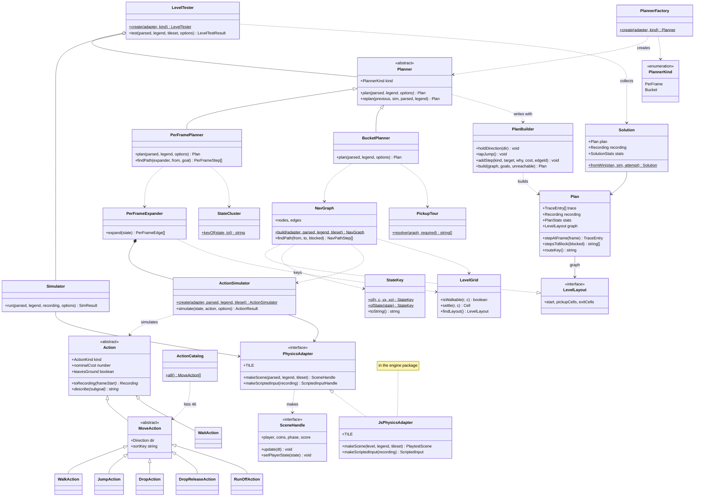

# agent

`packages/agent` · package `@2d-platform/agent`

Whether a level *can be solved*, and how. The planning agent searches for a
key recording that collects the required pickups and reaches the exit, by
A* over simulated physics, and returns up to five distinct solutions, each
with an explained trace. It never imports the engine: it defines the
[PhysicsAdapter](PhysicsAdapter.md) interface, and the engine's
`JsPhysicsAdapter` implements it. It depends on no other package. Its public
API is [`src/index.ts`](../../packages/agent/src/index.ts).

## Class diagram

`<|--` inheritance, `<|..` / `..|>` implements, `*--` composition, `o--`
aggregation, `-->` association (holds / refers to), `..>` dependency (uses /
creates). `$` marks a static member, `*` an abstract one.

## How planning works

1. **The level.** [LevelGrid](LevelGrid.md) reads the grid through the
   legend: which cells the player can stand in, and where the spawn,
   pickups and exits are ([LevelLayout](LevelLayout.md)).
2. **Goals.** The planner turns the required pickups into a visit order,
   ending at the exit. The per-frame planner takes the nearest pickup each
   time; the bucket planner costs whole tours with
   [PickupTour](PickupTour.md).
3. **Actions.** From any state the player can try the 46 candidates of
   [ActionCatalog](ActionCatalog.md): walks, jumps that let go of the
   direction at one of 12 frames, drops, drops that let go mid-fall, and
   run-offs.
4. **Physics decides.** An [ActionSimulator](ActionSimulator.md) runs each
   candidate on the real engine, through the [PhysicsAdapter](PhysicsAdapter.md),
   from the exact state, and reports where the player ends up. Candidates
   that die, bump a wall or end in mid-air are dropped; the rest are edges.
5. **Search.** A* finds the cheapest chain of edges (in frames) to each
   goal. [PerFramePlanner](PerFramePlanner.md) (the default) searches exact
   states, generating edges on demand with a
   [PerFrameExpander](PerFrameExpander.md) and merging near-identical
   states with [StateCluster](StateCluster.md).
   [BucketPlanner](BucketPlanner.md) searches a prebuilt
   [NavGraph](NavGraph.md) of bucketed states ([StateKey](StateKey.md)).
6. **Recording.** A [PlanBuilder](PlanBuilder.md) turns the chosen edges
   into key events and an explained trace — a [Plan](Plan.md).
7. **Check and vary.** [LevelTester](LevelTester.md) replays the recording
   with a [Simulator](Simulator.md). A win becomes a
   [Solution](Solution.md); then it blocks the solution's longest step and
   plans again, collecting up to five distinct solutions within the time
   budget ([SearchBudget](SearchBudget.md)).

## Pages

| Kind | Page | In one line |
|---|---|---|
| class | [LevelTester](LevelTester.md) | Plan, replay, vary: up to five solutions |
| class | [Solution](Solution.md) | A plan whose replay won |
| class | [SearchBudget](SearchBudget.md) | Wall-clock budget, progress and abort |
| abstract class | [Planner](Planner.md) | A strategy for planning a level |
| class | [PerFramePlanner](PerFramePlanner.md) | A* over exact physics states (default) |
| class | [BucketPlanner](BucketPlanner.md) | A* over a prebuilt bucketed NavGraph |
| class | [PlannerFactory](PlannerFactory.md) | Makes the planner for a `PlannerKind` |
| class | [Plan](Plan.md) | A recording plus its explained trace |
| class | [PlanBuilder](PlanBuilder.md) | Writes a plan step by step |
| class | [PerFrameExpander](PerFrameExpander.md) | Edges from an exact state, on demand |
| class | [StateCluster](StateCluster.md) | Merges near-identical states |
| class | [NavGraph](NavGraph.md) | The bucket planner's graph, and its A* |
| class | [PickupTour](PickupTour.md) | Which pickups, in which order |
| class | [StateKey](StateKey.md) | A bucketed node identity, "r,c,vx,xo" |
| class | [LevelGrid](LevelGrid.md) | The grid through the legend |
| class | [CellKey](CellKey.md) | The "r,c" form of a cell |
| abstract class | [Action](Action.md) | Something the player can do |
| abstract class | [MoveAction](MoveAction.md) | An action that holds a direction |
| class | [WalkAction](WalkAction.md) | Walk a number of cells |
| class | [JumpAction](JumpAction.md) | Jump, letting go at a chosen frame |
| class | [DropAction](DropAction.md) | Walk off a ledge |
| class | [DropReleaseAction](DropReleaseAction.md) | Walk off a ledge, letting go mid-fall |
| class | [RunOffAction](RunOffAction.md) | Walk, then carry the speed into a fall |
| class | [WaitAction](WaitAction.md) | Do nothing for a while |
| class | [ActionCatalog](ActionCatalog.md) | The 46 candidate actions |
| class | [ActionSimulator](ActionSimulator.md) | Where does this action end up? |
| class | [Simulator](Simulator.md) | Replay a recording headless |
| class | [AdapterGuard](AdapterGuard.md) | Checks an adapter at the boundary |
| interface | [PhysicsAdapter](PhysicsAdapter.md) | The agent's only link to an engine |
| interface | [SceneHandle](SceneHandle.md) | The scene surface the agent drives (plus `ScenePhase`) |
| interface | [SceneGame](SceneGame.md) | The scene's swappable input holder |
| interface | [InputSource](InputSource.md) | Any key source a scene reads |
| interface | [ScriptedInputHandle](ScriptedInputHandle.md) | A key source over a recording |
| interface | [PlayerState](PlayerState.md) | Exact position, speed, grounded |
| interface | [PlayerBody](PlayerBody.md) | A player state plus its size |
| interface | [Point](Point.md) | `{ x, y }` in pixels |
| interface | [Velocity](Velocity.md) | `{ vx, vy }` in px/s |
| interface | [ParsedLevel](ParsedLevel.md) | The level fields the agent reads (plus `PickupRequired`) |
| type | [LegendRecord](LegendRecord.md) | A legend as a plain record |
| interface | [LegendRecordEntry](LegendRecordEntry.md) | One glyph's entry |
| interface | [RecordingEvent](RecordingEvent.md) | One key event (plus `Recording`) |
| interface | [Cell](Cell.md) | A grid cell `{ r, c }` |
| interface | [LevelLayout](LevelLayout.md) | Spawn, pickups, exits, size |
| interface | [TraceEntry](TraceEntry.md) | One explained step |
| interface | [PlanData](PlanData.md) | What a Plan is made from |
| interface | [PlanStats](PlanStats.md) | Step counts |
| interface | [UnreachableGoal](UnreachableGoal.md) | A goal with no path |
| interface | [PlanOptions](PlanOptions.md) | Tileset and blocked edges for one plan |
| interface | [PerFramePlannerOptions](PerFramePlannerOptions.md) | Cluster tolerance and node cap |
| interface | [PerFrameEdge](PerFrameEdge.md) | An edge to an exact state |
| interface | [PerFrameStep](PerFrameStep.md) | One step of a per-frame path |
| interface | [PerFrameTargets](PerFrameTargets.md) | Exits and precision targets for an expander |
| interface | [ClusterTolerance](ClusterTolerance.md) | How close counts as the same |
| interface | [NavNode](NavNode.md) | A NavGraph node |
| interface | [NavEdge](NavEdge.md) | A NavGraph edge |
| interface | [NavPathStep](NavPathStep.md) | One step of a NavGraph path |
| interface | [ActionResult](ActionResult.md) | Where one action left the player |
| interface | [SimulateActionOptions](SimulateActionOptions.md) | Ask for a trajectory |
| interface | [SimResult](SimResult.md) | How a replay ended |
| interface | [SimulatorRunOptions](SimulatorRunOptions.md) | Tileset, time step, frame budget |
| interface | [SolutionStats](SolutionStats.md) | A solution's numbers |
| interface | [LevelTestOptions](LevelTestOptions.md) | Budget, progress, abort |
| type | [LevelTestResult](LevelTestResult.md) | Success or failure |
| interface | [LevelTestSuccess](LevelTestSuccess.md) | The solutions found |
| interface | [LevelTestFailure](LevelTestFailure.md) | Why none was found |
| enum | [PlannerKind](PlannerKind.md) | Per-frame or bucket |
| enum | [ActionKind](ActionKind.md) | walk, jump, drop, drop_release, run_off, wait |
| enum | [Direction](Direction.md) | left or right |
| enum | [XOffsetBucket](XOffsetBucket.md) | Which third of its cell |
| enum | [GlyphRole](GlyphRole.md) | The roles the agent reads |
| enum | [GoalKind](GoalKind.md) | pickup or exit |
| enum | [SimOutcome](SimOutcome.md) | won, dead or timeout |
| enum | [ActionOutcome](ActionOutcome.md) | ok, mid-air, dead or won |
| enum | [FailureReason](FailureReason.md) | Why a test stopped early |

`constants.ts` exports the engine physics numbers the agent plans against
(`TILE` = 20 px, `SPEED`, `JUMP_FORCE`, `GRAVITY`) and the jump-reach
envelope (`JUMP_MAX_HORIZ_CELLS` = 8, `JUMP_MAX_VERT_CELLS` = 4).

## Design overview

- **Strategy pattern.** "How do I search a leg?" has two answers, so
  [Planner](Planner.md) is an abstract class with two strategies,
  [PerFramePlanner](PerFramePlanner.md) and [BucketPlanner](BucketPlanner.md).
  Callers hold a `Planner` and never switch on which one it is;
  [PlannerFactory](PlannerFactory.md) maps a [PlannerKind](PlannerKind.md)
  to a class. Shared behaviour (`replan`, goal names) lives once in the base.
- **Template method.** `Planner.replan` is written once in the base and
  calls the abstract `plan`, so each strategy gets replanning for free.
- **An inheritance hierarchy with polymorphism.** Every action knows its
  own cost, key pattern, description and whether it leaves the ground, so
  the simulator and the planners call `action.toRecording()` instead of
  switching on a kind. [MoveAction](MoveAction.md) is an abstract middle
  layer: the 45 things that hold a direction, as opposed to waiting.
- **Adapter and dependency inversion.** The agent (the policy) defines the
  [PhysicsAdapter](PhysicsAdapter.md) interface it needs; the engine (the
  detail) implements it. Every class that simulates is handed an adapter in
  its constructor or factory, so tests can pass a stub (see
  `packages/agent/examples/headless.ts`) or a subclass that counts calls.
- **Composition.** [LevelTester](LevelTester.md) *has* a planner and a
  simulator; [PerFrameExpander](PerFrameExpander.md) *has* an
  [ActionSimulator](ActionSimulator.md). None of them inherit behaviour
  they don't need.
- **Static factories where work can fail or is expensive.**
  `NavGraph.build` simulates thousands of actions; `ActionSimulator.create`
  asks the engine for a scene; `LevelTester.create` checks the adapter.
  Their constructors are private.
- **Value objects and plain data.** [StateKey](StateKey.md) is a small
  immutable class with a text form; traces, stats and results stay plain
  interfaces because they are shown in the editor and printed as JSON by
  the CLI.
- **String enums match the data.** [ActionKind](ActionKind.md) values
  appear in traces and edge ids, [SimOutcome](SimOutcome.md) and
  [GoalKind](GoalKind.md) in the CLI's JSON. The contract type
  `ScenePhase` stays a union of strings so the engine's own `GamePhase`
  enum satisfies it (see [SceneHandle](SceneHandle.md)).
- **Behaviour is bit-for-bit unchanged.** Code moved into methods
  verbatim: the same candidate order, the same A* tie-breaking and map
  iteration order, the same arithmetic. `deno task gen:golden` reproduces
  the Python port's golden vectors byte for byte, and `deno task solve
  --all` reports the same solutions and stats.
