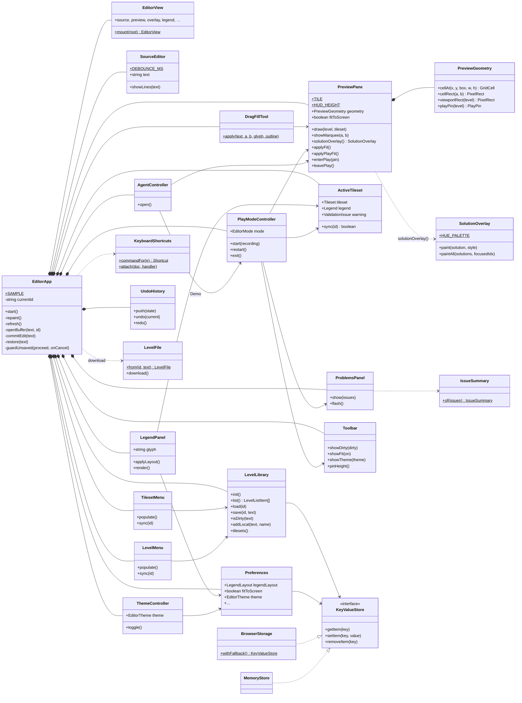
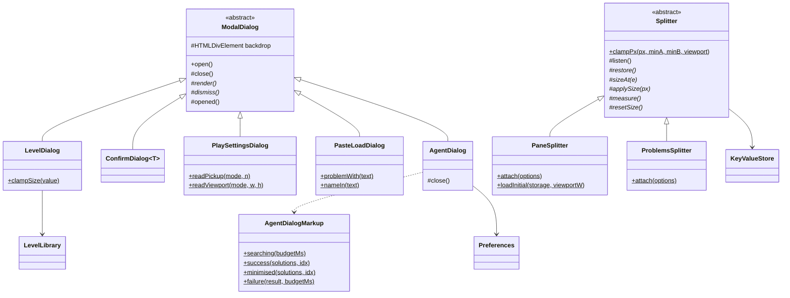

# editor

`apps/editor` · app, served at `/apps/editor/`

The level editor: write a level as ASCII text, see it drawn with a tileset
as you type, paint on the preview with the legend's glyphs, playtest it in
place, and ask the planning agent whether it can be solved. It is a
browser app that wires together all four packages
([level-format](../level-format/README.md), [render](../render/README.md),
[engine](../engine/README.md), [agent](../agent/README.md)); the page's
entry point is [`src/main.ts`](../../apps/editor/src/main.ts), which only
does `new EditorApp(root).start()`.

Unlike the packages, the editor is mostly *user interface*: DOM elements,
events and timing. The classes are shaped so that the logic worth testing
(the level library, undo, hit-testing, the dialogs' form rules, the agent
dialog's markup…) lives in pure classes or static methods that
`deno task test` runs without a browser, and the DOM wiring stays thin; the
end-to-end specs in `apps/editor/e2e/` cover the rest.

## Class diagram

The components, and who holds whom. `EditorApp` builds all of them.

The two families that use inheritance: the dialogs, and the splitters.

`*--` composition (built and owned), `-->` association (holds a
reference), `..>` dependency (uses), `<|--` inheritance, `..|>` implements,
`$` static, `*` abstract, `#` protected.

## How a keystroke becomes a preview

1. **Input.** The user types in the `#src` textarea. [SourceEditor](SourceEditor.md)
   reports `onInput` at once; [EditorApp](EditorApp.md) asks
   [LevelLibrary](LevelLibrary.md)`.isDirty(text)` and the
   [Toolbar](Toolbar.md) shows "● unsaved".
2. **Debounce.** SourceEditor restarts a 120 ms timer on every keystroke.
   When typing pauses it reports `onSettle`, and EditorApp pushes the text
   onto the [UndoHistory](UndoHistory.md) (one undo step per pause) and
   calls `refresh()`.
3. **Tileset.** `refresh()` parses the text with level-format's
   `Level.parse` and asks [ActiveTileset](ActiveTileset.md) to `sync` to
   its `# tileset:` line. That is free when the tileset has not changed;
   otherwise it loads (or takes from its cache) the render package's
   `Tileset`, builds its `Legend`, and the [LegendPanel](LegendPanel.md)
   re-renders. The [TilesetMenu](TilesetMenu.md) is synced to match.
4. **Validate.** `repaint()` (skipped while Play owns the canvas) parses the
   text again and validates it against the active legend, adding
   ActiveTileset's warning if a named tileset failed to load.
   [ProblemsPanel](ProblemsPanel.md) shows the one-line
   [IssueSummary](IssueSummary.md).
5. **Draw.** [PreviewPane](PreviewPane.md)`.draw` has render's
   `LevelRenderer` paint the level and the HUD band on `#preview`, sizes
   and clears the `#overlay` canvas, draws the dashed `# viewport:` guide,
   and re-applies Fit mode. Finally SourceEditor redraws the line-number
   gutter and the column ruler.

A drag on the preview takes a shorter path: [DragFillTool](DragFillTool.md)
turns the pointer into cells through [PreviewGeometry](PreviewGeometry.md),
rewrites the grid rows with level-format's `Rect`, and EditorApp's
`commitEdit` pushes the new text to the history and repaints at once.

## Pages

| Kind | Page | In one line |
|---|---|---|
| class | [EditorApp](EditorApp.md) | The composition root: builds the components and runs the edit cycle |
| class | [EditorView](EditorView.md) | The page's markup and typed references to its elements |
| class | [SourceEditor](SourceEditor.md) | The text area, gutter and ruler; debounced change events |
| class | [PreviewPane](PreviewPane.md) | The preview and overlay canvases, and Fit mode |
| class | [PreviewGeometry](PreviewGeometry.md) | Pointer ↔ cell ↔ pixel arithmetic for the preview |
| class | [DragFillTool](DragFillTool.md) | Drag on the preview to fill (or outline) a rectangle |
| class | [SolutionOverlay](SolutionOverlay.md) | Paints the agent's solution paths |
| class | [LegendPanel](LegendPanel.md) | The glyph palette, its layout, and the background menu |
| class | [ActiveTileset](ActiveTileset.md) | The open level's tileset and legend, loaded and cached |
| class | [ProblemsPanel](ProblemsPanel.md) | The one-line message bar |
| class | [IssueSummary](IssueSummary.md) | Condenses validation issues to one line |
| class | [Toolbar](Toolbar.md) | The toolbar buttons and their states |
| class | [TilesetMenu](TilesetMenu.md) | The Tileset menu |
| class | [LevelMenu](LevelMenu.md) | The Level menu |
| class | [ThemeController](ThemeController.md) | Light or dark mode |
| class | [PlayModeController](PlayModeController.md) | Play and Demo; owns the editor's mode |
| class | [AgentController](AgentController.md) | The Test button: agent, dialog, overlay |
| class | [KeyboardShortcuts](KeyboardShortcuts.md) | Ctrl/Cmd shortcuts → commands |
| abstract class | [ModalDialog](ModalDialog.md) | Backdrop, Esc and outside-click for every dialog |
| class | [LevelDialog](LevelDialog.md) | Level list and New level form |
| class | [ConfirmDialog](ConfirmDialog.md) | A message and a row of choices |
| class | [PlaySettingsDialog](PlaySettingsDialog.md) | Viewport and pickup rule |
| class | [PasteLoadDialog](PasteLoadDialog.md) | Load a level from pasted text |
| class | [AgentDialog](AgentDialog.md) | The Test dialog: search, results, retry |
| class | [AgentDialogMarkup](AgentDialogMarkup.md) | The Test dialog's HTML for each state |
| class | [LevelLibrary](LevelLibrary.md) | Bundled levels, drafts and pasted levels |
| class | [UndoHistory](UndoHistory.md) | Whole-buffer undo and redo |
| class | [LevelFile](LevelFile.md) | A level as a downloadable `.txt` |
| class | [Preferences](Preferences.md) | Typed, saved editor settings |
| class | [BrowserStorage](BrowserStorage.md) | localStorage as a `KeyValueStore` |
| class | [MemoryStore](MemoryStore.md) | An in-memory `KeyValueStore` |
| class | [ContentPaths](ContentPaths.md) | URLs of the levels and tilesets |
| abstract class | [Splitter](Splitter.md) | A draggable bar that resizes part of the page |
| class | [PaneSplitter](PaneSplitter.md) | Text pane ↔ preview |
| class | [ProblemsSplitter](ProblemsSplitter.md) | Editor ↔ message bar |
| interface | [KeyValueStore](KeyValueStore.md) | The storage contract (localStorage's shape) |
| interface | [LevelLibraryIO](LevelLibraryIO.md) | The fetch and storage the library uses (also `LevelFetch`) |
| interface | [LevelFetchResponse](LevelFetchResponse.md) | The part of a fetch Response the library reads |
| interface | [LevelManifestEntry](LevelManifestEntry.md) | One bundled level in the manifest |
| interface | [LocalLevelEntry](LocalLevelEntry.md) | One pasted level |
| interface | [LevelListItem](LevelListItem.md) | One row of `LevelLibrary.list()` |
| interface | [TilesetManifestEntry](TilesetManifestEntry.md) | One tileset in the manifest |
| interface | [LoadedTileset](LoadedTileset.md) | A cached tileset and its legend |
| interface | [SourceEditorEvents](SourceEditorEvents.md) | SourceEditor's callbacks |
| interface | [LegendPanelEvents](LegendPanelEvents.md) | LegendPanel's callbacks |
| interface | [ToolbarActions](ToolbarActions.md) | What each toolbar button does |
| interface | [DragFillHost](DragFillHost.md) | What the fill tool needs from the editor |
| interface | [PlayModeHost](PlayModeHost.md) | What Play needs from the editor |
| interface | [GridCell](GridCell.md) | A cell under the pointer |
| interface | [PixelRect](PixelRect.md) | A rectangle in canvas pixels |
| interface | [PlayPin](PlayPin.md) | The canvas's CSS size during Play |
| interface | [OverlaySolution](OverlaySolution.md) | The part of a solution the overlay paints |
| interface | [OverlayStyle](OverlayStyle.md) | Colour and opacity of one path |
| interface | [IssueLike](IssueLike.md) | Anything shaped like a validation issue |
| interface | [KeyChord](KeyChord.md) | The key-event fields a shortcut reads |
| interface | [SplitterOptions](SplitterOptions.md) | Document, window and storage for a splitter |
| interface | [NewLevelSpec](NewLevelSpec.md) | Tileset and size of a new level |
| interface | [LevelDialogOptions](LevelDialogOptions.md) | What the Levels dialog needs |
| interface | [ConfirmAction](ConfirmAction.md) | One choice in a ConfirmDialog |
| interface | [ConfirmOptions](ConfirmOptions.md) | What a ConfirmDialog needs |
| interface | [PlaySettings](PlaySettings.md) | Pickup rule and viewport |
| interface | [PlaySettingsOptions](PlaySettingsOptions.md) | What the Play Settings dialog needs |
| interface | [PastedLevel](PastedLevel.md) | Pasted text and its name |
| interface | [PasteLoadOptions](PasteLoadOptions.md) | What the Load dialog needs |
| interface | [AgentDialogOptions](AgentDialogOptions.md) | What the Test dialog needs (also `RunAgent`, `AgentDialogResult`) |
| enum | [EditorMode](EditorMode.md) | Edit, Play or Demo |
| enum | [LegendLayout](LegendLayout.md) | Legend right of or below the preview |
| enum | [EditorTheme](EditorTheme.md) | Dark or light |
| enum | [Shortcut](Shortcut.md) | The keyboard shortcut commands |

Three type aliases complete the code: `LevelFetch` (see
[LevelLibraryIO](LevelLibraryIO.md)), and `RunAgent` and
`AgentDialogResult` (see [AgentDialogOptions](AgentDialogOptions.md)).
`escapeHtml(value)` in `escapeHtml.ts` is the one free function: it makes
any text safe to put in `innerHTML`, and a class around one pure function
would add nothing.

## Design overview

- **One composition root.** [EditorApp](EditorApp.md) is the only class that
  knows every other one. It builds the components, passes each exactly the
  collaborators it needs through its constructor, and connects their events
  to its own methods. A component never looks another up or reads a global,
  so each can be read, and replaced, on its own.
- **Components talk through small typed interfaces.** A component that must
  call back into the editor declares what it needs as an interface —
  [SourceEditorEvents](SourceEditorEvents.md), [ToolbarActions](ToolbarActions.md),
  [DragFillHost](DragFillHost.md), [PlayModeHost](PlayModeHost.md) — and the
  editor passes an object literal satisfying it. The component depends on the
  contract, not on `EditorApp`.
- **Inheritance for real "is-a" families only.** Every dialog *is a*
  [ModalDialog](ModalDialog.md): the base handles the backdrop, Esc and
  outside clicks, and subclasses implement `render` and `dismiss` (the
  template method pattern). Both splitters *are* a [Splitter](Splitter.md),
  which runs the drag and asks its subclass for the axis, the CSS property
  and the reset. Everything else is composition.
- **Keep the logic out of the DOM.** Where a component has rules worth
  testing they sit in a pure class or a static method:
  [PreviewGeometry](PreviewGeometry.md) (hit-testing),
  `DragFillTool.apply` (the grid edit), [AgentDialogMarkup](AgentDialogMarkup.md)
  (the dialog's HTML), `PlaySettingsDialog.readPickup`,
  `KeyboardShortcuts.commandFor`, [IssueSummary](IssueSummary.md),
  [UndoHistory](UndoHistory.md). They run under `deno task test` with no
  browser; the DOM classes around them are thin and covered end to end.
- **Depend on interfaces for I/O.** [LevelLibrary](LevelLibrary.md) takes its
  fetch and its [KeyValueStore](KeyValueStore.md) through
  [LevelLibraryIO](LevelLibraryIO.md); [Preferences](Preferences.md) and the
  splitters take a `KeyValueStore` too. The app passes
  [BrowserStorage](BrowserStorage.md) (falling back to a
  [MemoryStore](MemoryStore.md) in private mode); tests pass a `MemoryStore`.
- **Enums for fixed sets**, as string enums whose values are the strings the
  editor has always stored or compared: [EditorMode](EditorMode.md),
  [LegendLayout](LegendLayout.md), [EditorTheme](EditorTheme.md),
  [Shortcut](Shortcut.md).
- **Behaviour is unchanged.** The page markup, element ids and classes,
  keyboard shortcuts, `localStorage` keys and formats, timings and the
  `window.__activeTileset` test hook are exactly as before; the editor's
  end-to-end specs pass against the restructured code.
