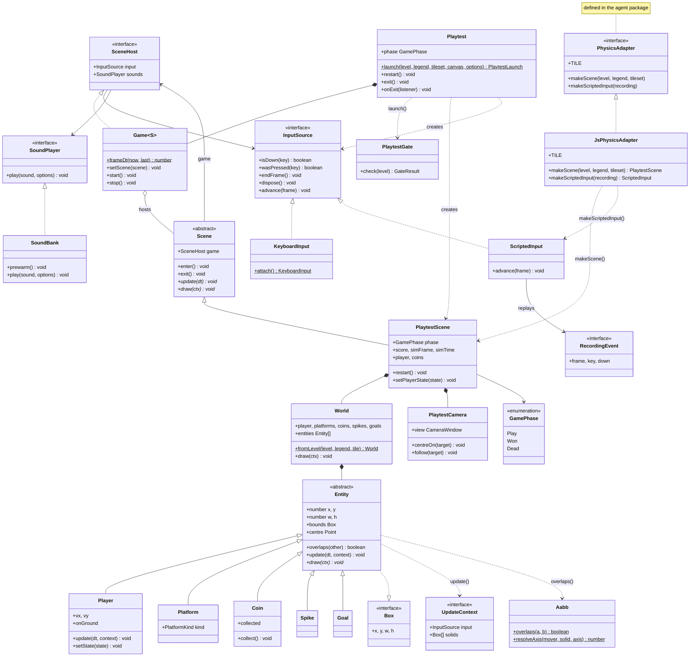

# engine

`packages/engine` · package `@2d-platform/engine`

How a level *plays*: the game loop, keyboard and scripted input, the
entities and their physics, the playtest scene and its camera, and
`Playtest.launch` to play a level on a canvas. `JsPhysicsAdapter` (shared
instance `jsAdapter`) offers the same engine to the planning agent.
Depends on `level-format`, `render`, and — for one interface type only —
`agent`. Its public API is [`src/index.ts`](../../packages/engine/src/index.ts).

Part of the code (the loop, input, entities, collision and sounds) is
adapted from [simple-platformer-1](https://github.com/dr-matt-smith/simple-platformer-1)
under CC BY 4.0 — see the package's [README](../../packages/engine/README.md).

## Class diagram

`<|--` inheritance, `<|..` implements, `*--` composition, `o--` aggregation,
`-->` association (holds / refers to), `..>` dependency (uses / creates).
`$` marks a static member, `*` an abstract one. `InputSource.advance` is
optional (only scripted sources have it).

## Pages

| Kind | Page | In one line |
|---|---|---|
| abstract class | [Entity](Entity.md) | A box in the world that updates and draws itself |
| class | [Player](Player.md) | The player's physics: run, jump, gravity, collision |
| class | [Platform](Platform.md) | A solid block |
| class | [Coin](Coin.md) | A pickup |
| class | [Spike](Spike.md) | A lethal hazard |
| class | [Goal](Goal.md) | The level exit |
| class | [World](World.md) | The entities a level becomes (`World.fromLevel`) |
| class | [Aabb](Aabb.md) | Box overlap and push-out tests |
| abstract class | [Scene](Scene.md) | One screen of the game: lifecycle hooks |
| class | [Game](Game.md) | The animation-frame loop that runs a scene |
| class | [PlaytestScene](PlaytestScene.md) | The rules of a playtest: pickups, hazards, exit, HUD |
| class | [PlaytestCamera](PlaytestCamera.md) | Dead-zone scrolling camera for `# viewport:` levels |
| class | [PlaytestGate](PlaytestGate.md) | Can this level be played? |
| class | [Playtest](Playtest.md) | Launch a level on a canvas; restart / exit |
| class | [KeyboardInput](KeyboardInput.md) | Keys from the browser window |
| class | [ScriptedInput](ScriptedInput.md) | Keys from a recording |
| class | [SoundBank](SoundBank.md) | Synthesised sound effects |
| class | [JsPhysicsAdapter](JsPhysicsAdapter.md) | The engine as the agent's `PhysicsAdapter` (`jsAdapter`) |
| interface | [InputSource](InputSource.md) | Where keys come from |
| interface | [SceneHost](SceneHost.md) | What a scene needs from its game |
| interface | [SoundPlayer](SoundPlayer.md) | Something that plays sounds |
| interface | [UpdateContext](UpdateContext.md) | What an entity reads while updating |
| interface | [Box](Box.md) | `{ x, y, w, h }` in pixels |
| interface | [Point](Point.md) | `{ x, y }` in pixels |
| interface | [Size](Size.md) | `{ w, h }` in pixels |
| interface | [RecordingEvent](RecordingEvent.md) | One key event of a recording |
| interface | [GateResult](GateResult.md) | The gate's verdict |
| interface | [PlaytestLaunch](PlaytestLaunch.md) | What `Playtest.launch` returns |
| interface | [LaunchOptions](LaunchOptions.md) | Options for `Playtest.launch` |
| interface | [GameOptions](GameOptions.md) | What `new Game` needs |
| interface | [PlayerStateOverride](PlayerStateOverride.md) | A pose to force the player into |
| interface | [CameraOrigin](CameraOrigin.md) | A camera position |
| interface | [DeadZone](DeadZone.md) | The camera's dead-zone size |
| interface | [PlayOptions](PlayOptions.md) | Options for playing a sound |
| interface | [SynthNote](SynthNote.md) | One note of a synthesised sound |
| enum | [GamePhase](GamePhase.md) | Play, won or dead |
| enum | [Key](Key.md) | The keys the game reads (plus the `KeyName` type) |
| enum | [PlatformKind](PlatformKind.md) | Ground or platform look |
| enum | [Axis](Axis.md) | X or Y |
| enum | [Sound](Sound.md) | The sound effects |

`constants.ts` exports the engine's tuning numbers (`TILE` = 20 px,
`SPEED`, `JUMP_FORCE`, `GRAVITY`) and `COLOURS`, unchanged from the
vendored original.

## Design overview

- **An inheritance hierarchy where there is a real "is-a".** Player,
  platform, coin, spike and goal all *are* boxes in the world, so they
  extend the abstract [Entity](Entity.md). The base holds what they share
  (position, size, overlap) and declares what each must supply (`draw`);
  only [Player](Player.md) overrides `update`.
- **Interfaces where there is only a shared contract.**
  [KeyboardInput](KeyboardInput.md) and [ScriptedInput](ScriptedInput.md)
  share no code, so they implement [InputSource](InputSource.md) instead of
  extending a base. The scene cannot tell a human from a replay — which is
  how Demo mode and the agent's simulator reuse the real game.
- **Depend on small interfaces.** [Scene](Scene.md) needs only a
  [SceneHost](SceneHost.md) (input + a [SoundPlayer](SoundPlayer.md)), not a
  [Game](Game.md) with a canvas. So [PlaytestScene](PlaytestScene.md) runs
  unchanged in the browser and headless inside the agent.
- **Static factories for work that can fail or has effects.**
  `World.fromLevel`, `KeyboardInput.attach`, `Playtest.launch`.
- **Adapter across a package boundary.** The agent defines
  `PhysicsAdapter`; [JsPhysicsAdapter](JsPhysicsAdapter.md) implements it.
  The engine imports only that interface's type, so the agent never depends
  on the engine.
- **String enums match the data.** [GamePhase](GamePhase.md) and
  [Key](Key.md) values are the strings the agent compares and recordings
  store.
- **Public where a contract demands it.** Most state is `private`; the
  fields the agent's `PhysicsAdapter` contract reads and writes (the
  player's position and velocity, the scene's `phase`, `score` and input
  clock, a coin's `collected`) stay public, and their pages say so.
- **Physics is bit-for-bit unchanged.** Code moved into methods verbatim,
  in the same order. `deno task gen:golden` reproduces the Python port's
  golden vectors byte for byte, and `deno task solve --all` still solves
  every bundled level.
