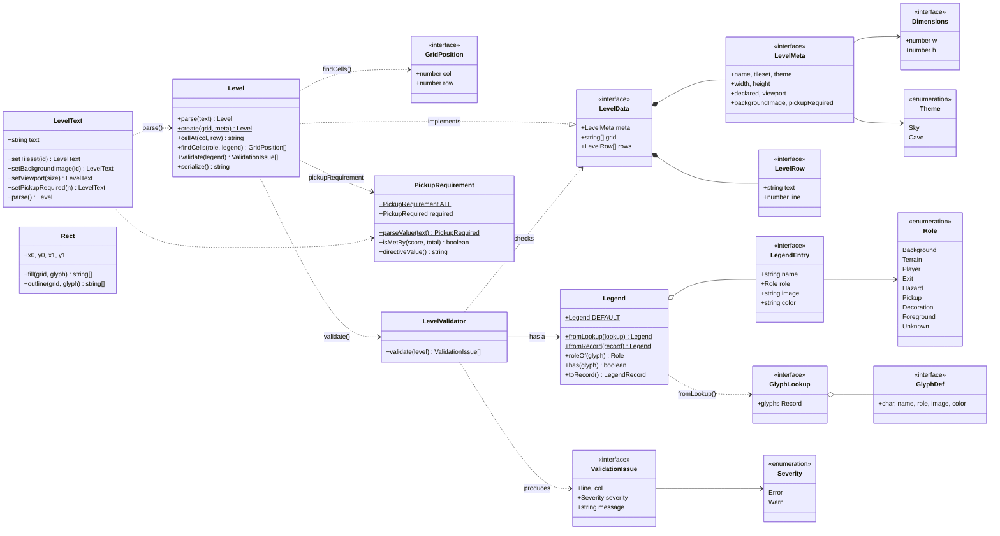

# level-format

`packages/level-format` · package `@2d-platform/level-format`

What a level *is*, independent of how it is drawn or played: the ASCII text
format and its header directives, the glyph legend and each glyph's role,
validation, and the pickup rule. It is the bottom layer of the monorepo —
pure logic, no DOM and no I/O — and every other package and app builds on
it. Its public API is [`src/index.ts`](../../packages/level-format/src/index.ts).

## Class diagram

`*--` composition, `o--` aggregation, `-->` association (holds / refers to),
`..>` dependency (uses), `..|>` implements.

## Pages

| Kind | Page | In one line |
|---|---|---|
| class | [Level](Level.md) | A parsed level: grid, header values, and queries over them |
| class | [LevelText](LevelText.md) | The raw level text, with setters that edit one directive in place |
| class | [Legend](Legend.md) | A tileset's glyph legend: which characters exist and what each does |
| class | [LevelValidator](LevelValidator.md) | Checks a level against a legend and lists its problems |
| class | [PickupRequirement](PickupRequirement.md) | The `# pickup-required:` win rule |
| class | [Rect](Rect.md) | A rectangle of cells for the editor's fill and outline tools |
| interface | [LevelData](LevelData.md) | The data of a parsed level, with no behaviour |
| interface | [LevelMeta](LevelMeta.md) | A level's header values and size |
| interface | [LevelRow](LevelRow.md) | One grid row as written, with its file line |
| interface | [Dimensions](Dimensions.md) | A `{ w, h }` size in cells |
| interface | [GridPosition](GridPosition.md) | A `{ col, row }` cell position |
| interface | [LegendEntry](LegendEntry.md) | One glyph's entry in a legend |
| interface | [GlyphLookup](GlyphLookup.md) | The `glyphs` part of a `tile_lookup.json` |
| interface | [GlyphDef](GlyphDef.md) | One raw glyph entry from `tile_lookup.json` |
| interface | [ValidationIssue](ValidationIssue.md) | One problem found by the validator |
| enum | [Role](Role.md) | What a glyph does (terrain, player, exit, …) |
| enum | [Severity](Severity.md) | How serious a validation issue is |
| enum | [Theme](Theme.md) | A level's visual theme |

Two type aliases complete the API: `PickupRequired` (`'all' | number`, the
stored form of the pickup rule — see [PickupRequirement](PickupRequirement.md))
and `LegendRecord` (a legend as a plain glyph → entry object — see
[Legend](Legend.md)).

## Design overview

- **Parse, then ask.** Text becomes a `Level` through a static factory
  (`Level.parse`), never a constructor, because parsing is the step that
  can meet bad input. The `Level` then answers questions about itself.
- **Two views of a level.** `Level` is the *meaning* of the text;
  `LevelText` is the *text itself*. The editor edits `LevelText` so that
  changing a setting never reformats what the author typed, and parses a
  `Level` whenever it needs to understand the result.
- **Data behind interfaces.** `LevelData` describes the shape of a parsed
  level. The validator, renderer and engine depend on that interface, not
  on the `Level` class, so they accept any object of the right shape.
- **Roles, not characters.** Behaviour keys off a glyph's `Role`, looked up
  in a `Legend`, so a tileset can rebind `P` to `@` or add three kinds of
  pickup without any code changing.
- **Enums match the data.** `Role`, `Severity` and `Theme` are string
  enums whose values are the strings in level files and `tile_lookup.json`,
  so saved data is unchanged.
- **Immutable values.** `Level`, `LevelText`, `Legend`, `Rect` and
  `PickupRequirement` never change after construction; editing methods
  return new objects.
- **Crossing a package boundary.** The agent package must not import this
  one, so it receives a legend as a plain record (`legend.toRecord()`), and
  the engine's adapter turns it back into a `Legend` (`Legend.fromRecord`).
