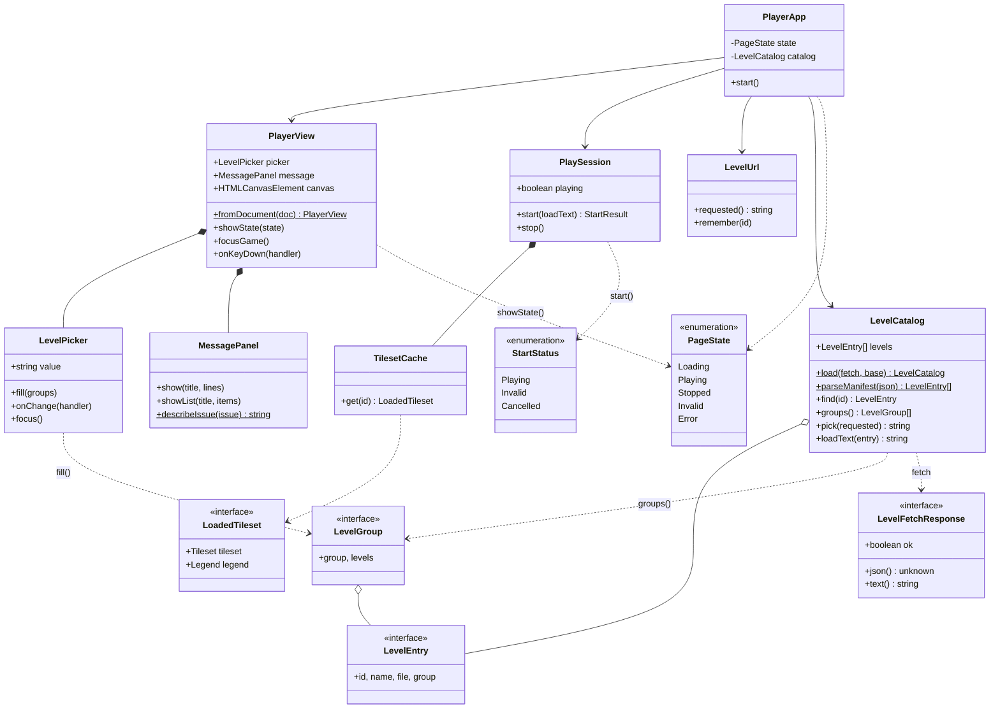

# player

`apps/player` · app (served at `/apps/player/`)

Choose a bundled level and play it full-window; `?level=<id>` links
straight to a level. It uses [level-format](../level-format/README.md),
[render](../render/README.md) and [engine](../engine/README.md). Controls
and usage are in the app's [README](../../apps/player/README.md).

The entry point is [`src/main.ts`](../../apps/player/src/main.ts), a
composition root that finds the page's elements, builds the real
collaborators and starts [PlayerApp](PlayerApp.md). Every class lives in
`apps/player/src/`.

## Class diagram

`*--` composition, `o--` aggregation, `-->` association (holds / refers to),
`..>` dependency (uses). `PlaySession` launches the engine's `Playtest`;
`TilesetCache` loads render's `Tileset`.

## Pages

| Kind | Page | In one line |
|---|---|---|
| class | [PlayerApp](PlayerApp.md) | The app: page state, level choice, keyboard, play |
| class | [PlayerView](PlayerView.md) | The page's elements, wrapped in view objects |
| class | [LevelPicker](LevelPicker.md) | The level `<select>`, with an `<optgroup>` per group |
| class | [MessagePanel](MessagePanel.md) | The message over the stage |
| class | [LevelUrl](LevelUrl.md) | `?level=<id>`: read it, keep it current |
| class | [LevelCatalog](LevelCatalog.md) | The bundled levels: manifest, groups, level text |
| class | [PlaySession](PlaySession.md) | Level text in, a running game on the canvas out |
| class | [TilesetCache](TilesetCache.md) | Each tileset and its legend, loaded once |
| interface | [LevelEntry](LevelEntry.md) | One row of the levels manifest |
| interface | [LevelGroup](LevelGroup.md) | A run of levels under one heading |
| interface | [LevelFetchResponse](LevelFetchResponse.md) | The part of a fetch Response the catalog reads |
| interface | [LoadedTileset](LoadedTileset.md) | A tileset with its legend |
| enum | [PageState](PageState.md) | What the page is doing (`body[data-state]`) |
| enum | [StartStatus](StartStatus.md) | How starting a level went |

Three type aliases complete the model: `LevelFetch` (the injected fetch,
see [LevelFetchResponse](LevelFetchResponse.md)), `StartResult` (see
[StartStatus](StartStatus.md)) and `TilesetLoader` (see
[TilesetCache](TilesetCache.md)).

## Design overview

- **A composition root.** `main.ts` is the only code that touches globals
  (`document`, `location`, `history`, `fetch`). It builds the objects and
  hands them to [PlayerApp](PlayerApp.md), which never queries the DOM.
- **An explicit state machine.** The page is always in one
  [PageState](PageState.md); `PlayerApp` owns it and mirrors it on
  `<body data-state>` through the view, so the CSS and the e2e specs see the
  same value the code does.
- **View objects.** [LevelPicker](LevelPicker.md) and
  [MessagePanel](MessagePanel.md) each wrap one element and offer
  intention-revealing methods (`fill`, `showList`), so the app reads as
  steps rather than DOM calls. [PlayerView](PlayerView.md) composes them.
- **Depend on interfaces.** [LevelCatalog](LevelCatalog.md) takes its fetch
  as a `LevelFetch`, [LevelUrl](LevelUrl.md) takes a location and history,
  and [TilesetCache](TilesetCache.md) takes a loader. Each is unit-tested
  in Deno with fakes; only the canvas and keyboard need the browser (e2e).
- **Encapsulated concurrency.** [PlaySession](PlaySession.md) hides the
  generation counter that cancels an out-of-date start, and
  [StartStatus](StartStatus.md) tells the app what happened.
- **Behaviour is unchanged.** Element ids, classes, states, URL handling and
  keys are as before; the player's e2e spec passes unchanged.
