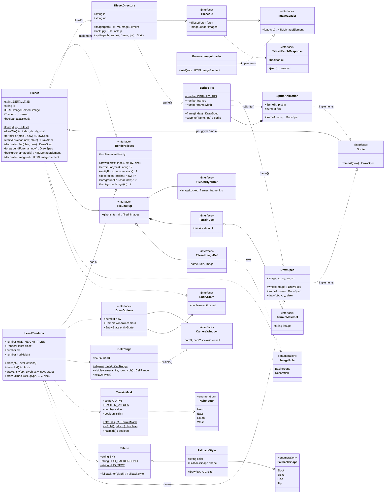

# render

`packages/render` · package `@2d-platform/render`

What a level *looks like*: loading a tileset (`tile_lookup.json` and its
images), autotiling terrain, animated sprites, and drawing a level — with an
optional scrolling camera and the HUD band — onto a 2D canvas. The editor
preview and the engine's playtest both draw through it, so what the author
edits is pixel-identical to what they play. It depends only on
[level-format](../level-format/README.md). Its public API is
[`src/index.ts`](../../packages/render/src/index.ts).

## Class diagram

`*--` composition, `o--` aggregation, `-->` association (holds / refers to),
`..>` dependency (uses), `..|>` implements. `?` marks an optional method.

## Pages

| Kind | Page | In one line |
|---|---|---|
| class | [Tileset](Tileset.md) | A loaded tileset that answers "what do I draw for this cell?" |
| class | [TilesetDirectory](TilesetDirectory.md) | A tileset's folder: URLs, and loading the files in it |
| class | [BrowserImageLoader](BrowserImageLoader.md) | The real image loader, through an `` element |
| class | [DrawSpec](DrawSpec.md) | An image and the part of it to draw into a cell |
| class | [SpriteStrip](SpriteStrip.md) | A horizontal strip of frames; decides still or animated |
| class | [SpriteAnimation](SpriteAnimation.md) | A strip played on a loop, frame chosen from the time |
| class | [LevelRenderer](LevelRenderer.md) | Draws a level and the HUD band onto a canvas |
| class | [CellRange](CellRange.md) | The rectangle of cells a draw visits |
| class | [TerrainMask](TerrainMask.md) | A terrain cell's solid neighbours, as the 0–15 autotile key |
| class | [Palette](Palette.md) | The fixed colours and each glyph's fallback style |
| class | [FallbackStyle](FallbackStyle.md) | A colour and shape that can draw itself |
| interface | [Sprite](Sprite.md) | Anything that gives a `DrawSpec` for a moment in time |
| interface | [RenderTileset](RenderTileset.md) | What the renderer needs from a tileset |
| interface | [DrawOptions](DrawOptions.md) | Per-frame settings for `LevelRenderer.draw` |
| interface | [CameraWindow](CameraWindow.md) | The part of the world a camera shows |
| interface | [EntityState](EntityState.md) | Game state that swaps sprites (the locked exit) |
| interface | [TilesetIO](TilesetIO.md) | The fetch and image loader a tileset uses |
| interface | [ImageLoader](ImageLoader.md) | Loads an image, or resolves null |
| interface | [TilesetFetchResponse](TilesetFetchResponse.md) | The part of a fetch Response the tileset reads |
| interface | [TileLookup](TileLookup.md) | The whole `tile_lookup.json` |
| interface | [TilesetGlyphDef](TilesetGlyphDef.md) | One glyph entry, with its sprite fields |
| interface | [TerrainDecl](TerrainDecl.md) | The `terrain` block: images per mask |
| interface | [TerrainMaskDef](TerrainMaskDef.md) | One terrain image entry |
| interface | [TilesetImageDef](TilesetImageDef.md) | One `images.<id>` entry |
| enum | [ImageRole](ImageRole.md) | How an `images` entry is used |
| enum | [Neighbour](Neighbour.md) | The four sides of a cell |
| enum | [FallbackShape](FallbackShape.md) | The shape drawn for a glyph with no sprite |

Four type aliases complete the API: `RenderLevel` (`Pick<LevelData, 'grid' |
'meta'>`, what `draw` reads — see [LevelRenderer](LevelRenderer.md)),
`TilesetFetch` (see [TilesetIO](TilesetIO.md)), and `TerrainMasks` /
`TilesetImages` (see [TileLookup](TileLookup.md)).

## Design overview

- **Load, then ask.** `Tileset.load` is a static factory because loading
  does I/O and can fail; the resulting `Tileset` is immutable and answers
  questions (`entityFor`, `terrainFor`, …) with a `DrawSpec` or `null`.
- **Null means "draw a shape".** Anything missing — the lookup file, an
  image, a glyph's sprite — degrades to the `Palette` fallback shape, so
  every level can be drawn with every tileset, or with none.
- **Polymorphic sprites.** Still images (`DrawSpec`) and animations
  (`SpriteAnimation`) both implement `Sprite`, so the tileset stores them
  alike and asks each for `frameAt(now)`. `SpriteStrip.toSprite` is the one
  place that decides which to make.
- **Depend on interfaces.** The renderer holds a `RenderTileset`, not a
  `Tileset`; the tileset takes its I/O through `TilesetIO` / `ImageLoader`.
  Tests pass small fakes for both, with no DOM or network.
- **Behaviour next to data.** `DrawSpec` and `FallbackStyle` draw
  themselves; `TerrainMask` knows which masks are thin; `CellRange` knows
  how to walk its cells. The renderer's passes are then short and read as
  a list of steps.
- **Enums for fixed sets.** `ImageRole` (values as in `tile_lookup.json`),
  `Neighbour` and `FallbackShape` are string enums, like the rest of the
  project.
- **Behaviour is unchanged.** The unit tests check the exact canvas calls
  the renderer makes, and the editor's end-to-end tests check pixels; both
  pass unchanged against the function-based code this replaced.
