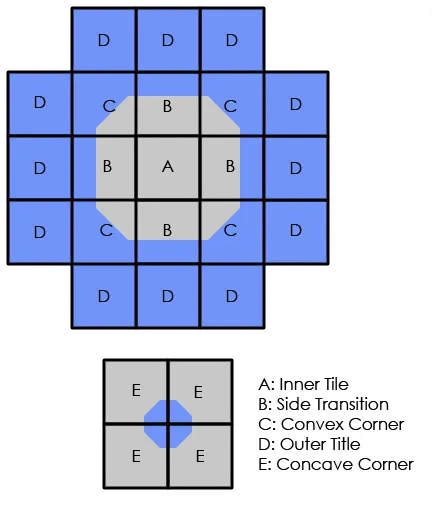

All of this is of course trivial these days. If you’ve got a 24-bit 2D graphics engine, life is grand. I still get warm fuzzy feelings thinking about our mad plans though.

You’ll need to chop these up into the various pieces and then knock out the transparent color. It is a bit like a jigsaw puzzle, but it follows the same basic pattern of my other tiles sets. You can use the test pictures posted on this page to see if you are fitting everything together correctly.

